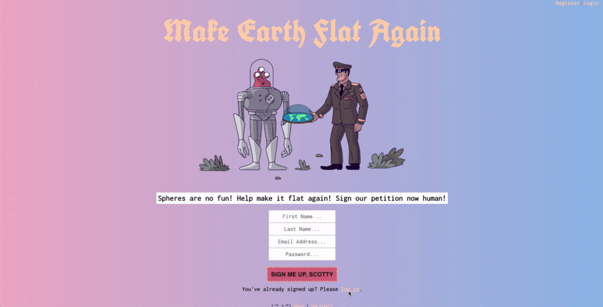
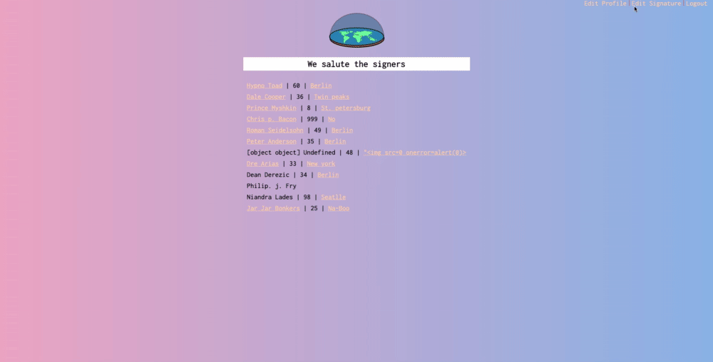

# Make Earth Flat Again

"Make Earth Flat Again" is a satirical online petition with nods to B-Movies and animation. Done in about a week during my stint at [SPICED Academy](https://www.spiced.academy/program/full-stack-web-development/).

<b>Note:</b> This project was hosted for years on Heroku, before their free tier shut down. At this point the code and libraries are years old, out of date and the whole project needs major refactoring. I have no interest in rewriting this, so this repo will remain here as a snapshot it time. :)

---

## Preview

## Tech

CSS, JavaScript, Handlebars.js, Canvas, Node.js / Express, PostgreSQL and Heroku

## Features

-   Users can register a profile (and edit it later), log in and log out as they please

-   Registration requires certain information and is split into required and optional, errors are rendered if required info isn't entered

-   Registered user can sign the petition (with Canvas), also delete the signature and re-do it

-   User and city names are converted to begin with a capital letter

-   Signers can see the total of signees, other signers and filter based on city

-   Nav logic: changes depending on where a user is on the site

-   Logged-in users cannot access the registration or login pages (and are redirected). Logged-out users can only access the registration and login

-   Clicking on about on the registration page opens an overlay with information about the project.

## Goals while doing the project

-   Learn modular website design with Handlebars, use Canvas for the online signature

-   Getting familiar with Express / Node.js / Cookies

-   Building user profiles

-   Recognizing vulnerabilities, using CSURF

-   Deploying a non-static site for the first time (on Heroku in this case)

## Credits

Illustrations (for the most part) by https://icons8.com
